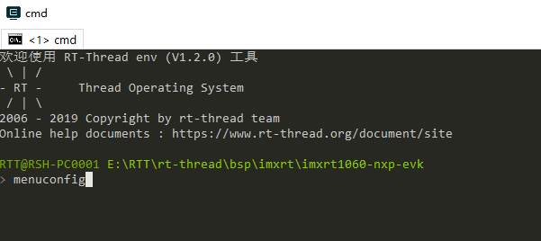
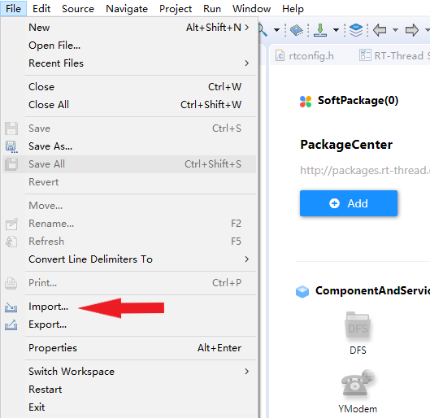
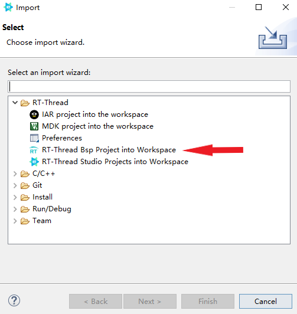
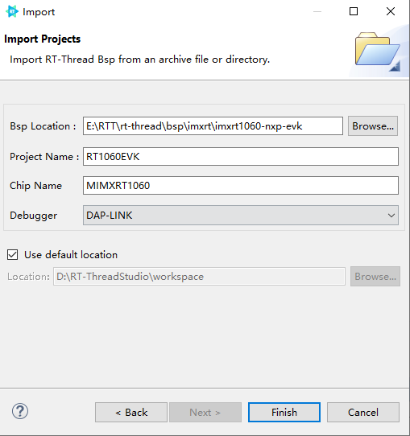
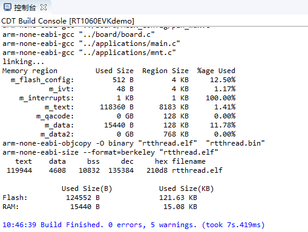
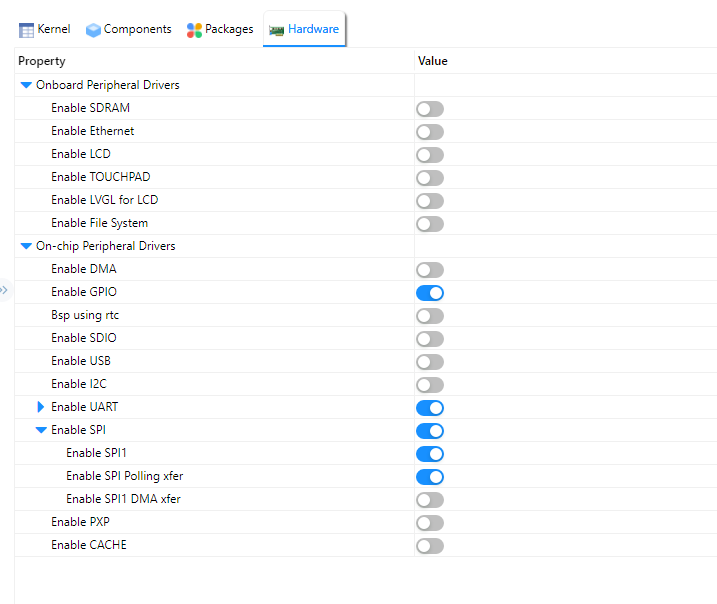
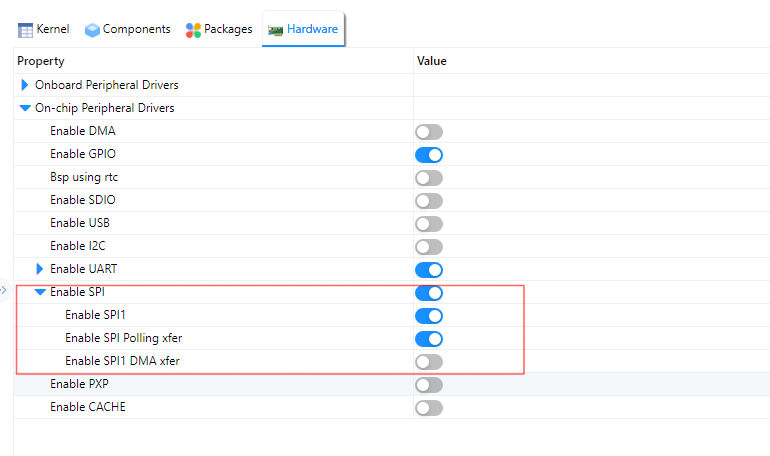
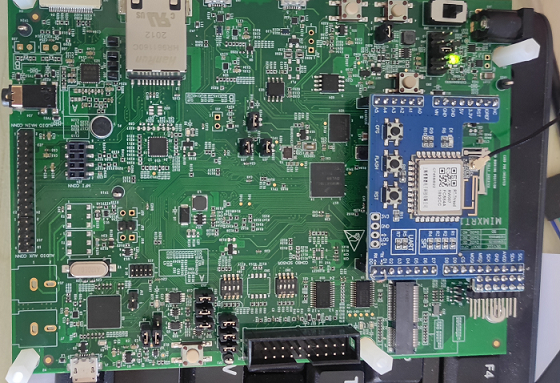

# MIMXRT1060-EVK User Manual

**English** | [中文](MIMXRT1060-EVK上手指南.md)

This manual records the execution instruction of the MIMXRT1060-EVK on RT-Thread homebuilt IDE RT-Thread Studio. 

## 1 Preparation

- Clone the RT-Thread repository from GitHub to your local. [Link](https://github.com/RT-Thread/rt-thread)
- Download and install RT-Thread Studio. [Link](https://www.rt-thread.io/studio.html)
- Prepare the [RW007](https://github.com/RT-Thread-packages/rw007/blob/master/README.md) module.

## 2 Quickly Get Started

### 2.1 menuconfig to configure the project

Open the directory where the MIMXRT1060-EVK BSP is located and use the menuconfig command in the [ENV tool](https://www.rt-thread.io/download.html?download=Env) to configure the project



### 2.2 Cancel the configuration that is not needed, as follows:

Set the Onboard Peripheral Drivers option:


Set the On-chip Peripheral Drivers option:


### 2.3 Go to File, and click the Import



### 2.4 Import RT-Thread BSP to workspace 



### 2.5 Fill out the project info



### 2.6 Compile project



Till now, the project is compiled, and the preparation is completed.

## 3 Use RT-Studio to Configure BSP Driver 

Each BSP of RT-Thread already has several drivers by default, such as on-chip peripheral driver and on-board peripheral driver, and the drivers can be enabled by opening the corresponding configuration and setting the parameters according to the use environment on RT-Studio IDE. Since the pin has the multiplexing function, it may not have both the available on-chip peripheral driver and on-board peripheral driver at the same time, so it is necessary to check the schematic while enabling the corresponding peripheral drivers.

RT-Thread has a lot of up-for-grab software packages, by using RT-Studio IDE, the software packages can be easily added to the project.



## 4 Connect to Internet: Use the RW007 module

The RW007 is a high-speed WIFI module that uses SPI to communicate with the host. Check the [User Manual](https://github.com/RT-Thread-packages/rw007/blob/master/README.md).

The SPI interface provided by the MIMXRT1060-EVK onboard Arduino interface has duplicate pins with the pins used by the SDIO interface of the SD card, so the on-board SPI interface is not connected by default. We'll be needing you to connect it, check out the location marked DNP in the schematic diagram below (this step is necessary when using the SPI interface). You can use the SPI interface led by the onboard Arduino interface, in this case, the on-board SD card slot is not available.


### 4.1 Configure the onboard SPI peripherals

RW007 supports SPI interface for communication, MIMXRT1060-EVK supports SPI driver, defaults to using polling mode to communicate with RW007 (currently it does not support interrupt and DMA mode to communicate with RW007), the following shows how to use RT-Studio to configure SPI:



### 4.2 Configure the RW007 package using RT-Studio

Click the RT-Thread Settings option on the left, there is a configuration menu will be shown on the right, enter RW007 in the search bar, and select `rw007:SPI WIFI rw007 driver`, the corresponding configuration parameters are as follows:


### 4.3 Plug the RW007 module into the onboard Arduino interface



### 4.4 Modify the RW007 example

Since the default example of the RW007 package is based on the STM32, minor modifications are required on the RT1060-EVK, modify the `rw007_stm32_port.c` file in the example folder in the RW007 package.

Modify the `int wifi_spi_device_init(void)` function, replacing the example with the code given below:

```
int wifi_spi_device_init(void)
{
    char sn_version[32];
    
    rw007_gpio_init();
    rt_hw_spi_device_attach(RW007_SPI_BUS_NAME, "wspi", RW007_CS_PIN);
    rt_hw_wifi_init("wspi");

    rt_wlan_set_mode(RT_WLAN_DEVICE_STA_NAME, RT_WLAN_STATION);
    rt_wlan_set_mode(RT_WLAN_DEVICE_AP_NAME, RT_WLAN_AP);

    rw007_sn_get(sn_version);
    rt_kprintf("\nrw007  sn: [%s]\n", sn_version);
    rw007_version_get(sn_version);
    rt_kprintf("rw007 ver: [%s]\n\n", sn_version);

    return 0;
}
```

### 4.5 After the modification is completed, compile the project and burn the firmware


`rw007 sn` and `rw007 ver` are successfully output, and RW007 driver is successfully connected. 

### 4.6 WIFI connection test

Enter the `wifi scan` command into the shell to search for WIFI.


Enter `wifi` and press `tab` to list wifi-related commands:


Use the ping command to test if the WIFI connection is available:


At this point, the basic environment of the MIMXRT1060-EVK is successfully set up!