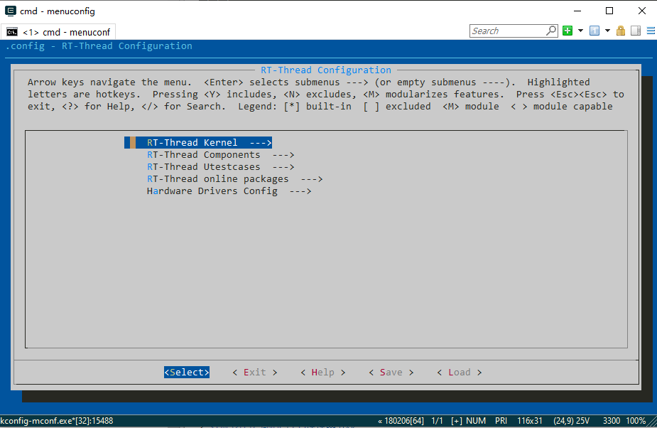
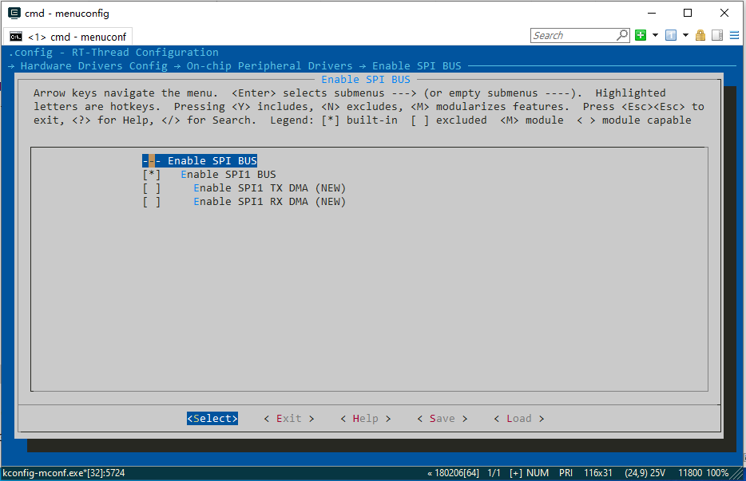
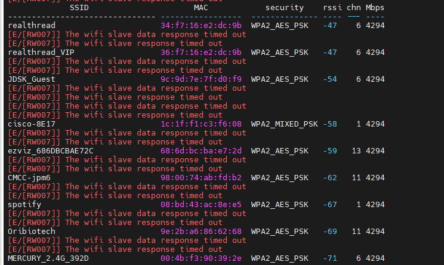

#STM32U575-NUCLEO Getting Started Guide

STM32U575-NUCLEO Getting Started Guide is introduced by using the example of SPI1 driving RW007 module to realize the introduction of STM32U575-NUCLEO.

##Preparatory Work

Before STM32U575-NUCLEO driver RW007 runs, the following preparations are essential, and you will need:

> 1.STM32U575-NUCLEO   
2.RW007 WiFi module  
3.Mini-USB Connecting cable (connecting the development board with the computer)  
4.ENV Compile build environment（[Installation instructions](https://www.rt-thread.org/document/site/programming-manual/env/env/)）  
5.common software（git,Keil5,STM32CubeMX,Serial debugging, etc）  

##Start on the Road

RT-Thread contains RW007 software package, so users don't need to write their own drivers. Taking SPI mode as an example, this paper introduces how to drive RW007 module on STM32U575-NUCLEO, and complete basic WiFi functions such as AP scanning and connection.

## Hardware connection

Thanks to the Arduino interface on Nucleo, just plug RW007 into the development board, and the hardware connection between them can be completed.

  

According to the following schematic diagram, the corresponding table between IO interfaces and functions can be found as follows: 
 
    

	|STM32 pin name | pin serial number  |Arduino Interface serial number|function   |   
	|PA5            |	5	             |D13	                         |BOOT0/CLK  |  
	|PA6            |	6	             |D12                            |MISO       |  
	|PA7            |	7	             |D11	                         |MOSI       |    
	|PD14           |	62               |D10	                         |BOOT1/CS   |  
	|PD15           |	63	             |D9	                         |INT/BUSY   |  
	|PF12           |	92	             |D8	                         |RESET      |  

##STM32 BSP Deploy（Menuconfig）
###1.Download RT-Thread Source Code

GitHub link：[https://github.com/RT-Thread/rt-thread](https://github.com/RT-Thread/rt-thread)    
Open the 'rt-thread\bsp\stm32' directory and you will see the development board model supported by rt-thread. It is not difficult to get RT-Thread running on STM32, but bsp needs to be configured briefly before compiling the kernel components.The bsp used in this experiment was stm32u575-st-nucleo.

###2.The SPI Initializer is Configured Through CubeMX

In general, the pin assignment of STM32 series can open the CubeMX project corresponding to the CubeMX_Config.ioc in the board\ CubeMX_Config directory in BSP, configure SPI1, generate code, and save and exit.  

  
 
###3. Configure the RW007 Package Through Menuconfig

Go to the rt-thread\ bsp\ stm32\ stm32u575-st-nucleo folder, right-click to open the ENV window (provided that the ENV environment has been built under Windows), and type menuconfig to configure the system:  

3.1 The communication between the development board and the module depends on the SPI device. The SPI driver has been implemented in bsp and can be used as long as it is opened in the setting. Go to `On-chip Peripheral Drivers` under `On-chip Peripheral-> `, check the `Enable SPI BUS-- >` option, press enter to enter, and further select `Enable SPI1 BUS` to complete the configuration:  

 

If there is no configuration for the corresponding spi in the menuconfig in the bsp, you can increase the configuration of the corresponding spi by modifying the Kconfig file. Add the configuration of SPI1 to the path of Kconfig under board/Kconfig, `menu "On-chip Peripheral Drivers" `. 

	menuconfig BSP_USING_SPI
		bool "Enable SPI BUS"
		default n
		select RT_USING_SPI
		if BSP_USING_SPI
		    config BSP_USING_SPI1
		        bool "Enable SPI1 BUS"
		        default n
		
		    config BSP_SPI1_TX_USING_DMA
		        bool "Enable SPI1 TX DMA"
		        depends on BSP_USING_SPI1
		        default n
		        
		    config BSP_SPI1_RX_USING_DMA
		        bool "Enable SPI1 RX DMA"
		        depends on BSP_USING_SPI1
		        select BSP_SPI1_TX_USING_DMA
		        default n
				
		endif

3.2 Configure the RW007 Package.

RT-Thread provides supporting driver support for RW007 modules in the form of software packages. The default options of the system do not include software packages. Users need to enable them manually: return to the Menuconfig main interface through the Esc key, enter `RT-Thread online packages-- > `, `IoT-internet of things->`, `Wi-Fi-- > `, and check the `rw007: SPI WIFI rw007 driver-- >` option:
  
RW007 package Github repository link：[RT-Thread-packages/rw007: RW007 (SPI Wi-Fi module) driver for RT-Thread](https://github.com/RT-Thread-packages/rw007)  

Then press Enter key to further set the parameters of the software package, complete the configuration of SPI bus and IO, change the bus device name `RW007 BUS NAME` to spi1, then configure SPI to control IO, and fill in each pin number according to the serial number of the following figure:   
  

3.3 Open the WiFi framework.

The RW007 driver uses WLAN-related APIs. Click the following options to open the WiFi framework: `RT-Thread Components-- > `, `Device Drivers-- >`, `Using WiFi-- > `, and check `Using Wi-Fi framework`:  

3.4 Save Menuconfig configuration.

After completing the above three steps, the bsp configuration is complete, but the most important step is not to be omitted. Save the Menuconfig configuration: press the Esc key all the way to exit, and select Yes in the Save prompt window to confirm.

###4. Modify part of the project code.

Open the project and replace the content of the `wifi_spi_device_init (void) `function in the `wifi_spi_device_init port.c` file with the following code:

	int wifi_spi_device_init(void)
	{
	    char sn_version[32];
	
	    rw007_gpio_init();
	    rt_hw_spi_device_attach(RW007_SPI_BUS_NAME, "wspi", RW007_CS_PIN);
	    rt_hw_wifi_init("wspi");
	
	    rt_wlan_set_mode(RT_WLAN_DEVICE_STA_NAME, RT_WLAN_STATION);
	    rt_wlan_set_mode(RT_WLAN_DEVICE_AP_NAME, RT_WLAN_AP);
	
	    rw007_sn_get(sn_version);
	    rt_kprintf("\nrw007  sn: [%s]\n", sn_version);
	    rw007_version_get(sn_version);
	    rt_kprintf("rw007 ver: [%s]\n\n", sn_version);
	
	    return 0;
	}

###5. Compile and Download the Project.

Use the Build button of the toolbar to compile the project. 0Error (s) indicates that the compilation is successful. Connect the development board to the computer, and then click the Download button to download the firmware to the development board.

## Running and Testing Module Functions.

After downloading the program, it can automatically reset and run, open the serial port tool (recommended to use XShell and other interactive terminals), and set the parameter to 1152008-1mi N. If the system starts normally and there is no problem with the communication between the development board and the module, you will see the following initialization print message:   

    
When rw007 sn and rw007 ver can output normally without garbled code, the RW007 driver is successful! 

Wifi networking test.

Enter the wifi scan command in shell to search for wifi:  

  

Connection Target wifi Test:
    
   
The figure above shows that wifi successfully connects to the hotspot Meet.  
At this point, the basic environment of `STM32U575- NUCLEO` is built and tested!

## References：
   
1. [STM32F401 Nucleo-64 uses SPI to drive RW007](https://www.rt-thread.org/document/site/#/rt-thread-version/rt-thread-standard/application-note/packages/rw007_module_using/an0034-rw007-module-using?id=rw007)  
2. [STM32U575-NUCLEO Schematic Download](https://www.st.com/resource/en/schematic_pack/mb1549-u575ziq-c03_schematic.pdf)

## Matters Needing Attention：  

1. It is best to use a newer version of MDK, and this experiment was carried out under the MDK5.36 version.
2. Please choose the latest version of the RW007 software package, otherwise the version will not be compatible and the project will report an error. If you have not selected the latest version of the RW007 package, download the RW007 package in the link below and replace the file in `bsp\ stm32\ stm32u575-st-nucleo\ packages\ rw007- xxx`! (however, the above step of modifying part of the project code is also necessary. If the content of the `wifi_spi_device_init (void) `function in the project `wifi_spi_device_init port.c` file is the same as that given, it can be ignored! ).    
RW007 package Github repository link: [RT-Thread-packages/rw007: RW007 (SPI Wi-Fi module) driver for RT-Thread](https://github.com/RT-Thread-packages/rw007) 
3. At present, in this experimental test, it is found that RW007 will time out, and a suitable solution has not been found, but it does not affect the normal use of RW007 module.